# Problem 1: K-Means Clustering

## Problem 1e: Clustering 2D points [2 points]

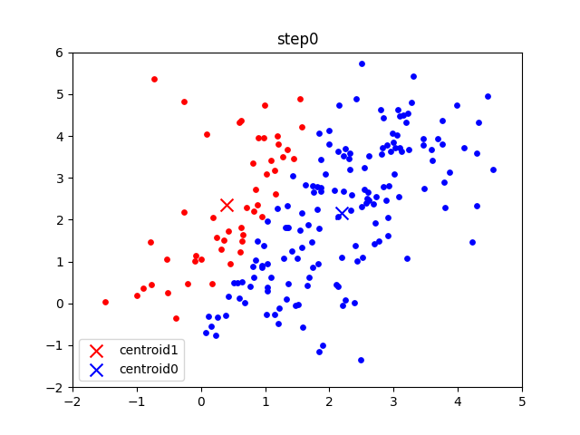
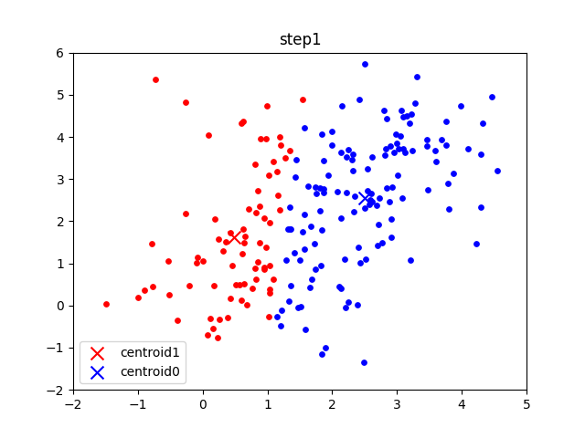

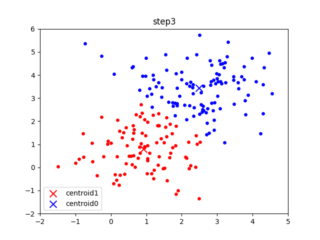
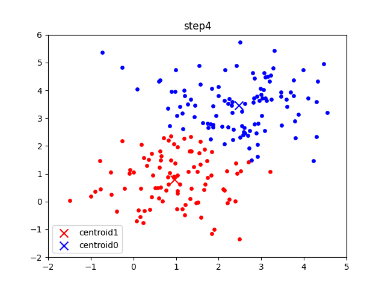

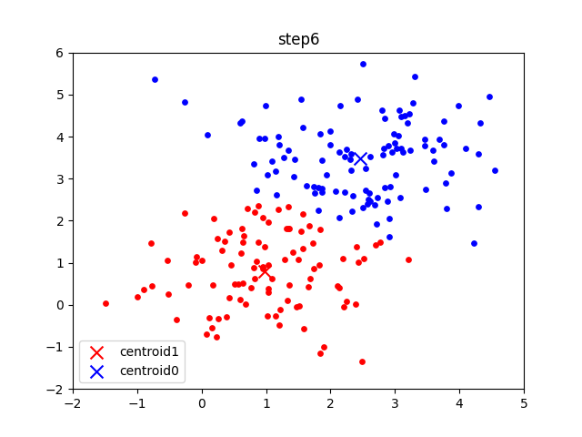

## Problem 1f: Trying the Algorithm on MNIST [2 points]

Each centroid is in some way a representative of all the points that belong to said centroid. For example, in an optimal clustering, there may be a cluster of points that classify to the number 7. A point that falls exactly on the centroid obviously belongs to the cluster, and thus represents 7 and must look like the number 7. Very slight deviations from the centroid would still group the point to the cluster, and as an image this represents variations on the handwriting from the centroid's representation of 7, such as a curved tail or a lengthy top. As the centroid, its representation of 7 is 'resilient' to many different kinds of variations, making it, to put it roughly, _the_ number 7.

That said, this way of classifying MNIST appears to be quite inefficient compared to conventional CNNs, and for good reason. Looking at the image representation of the centroids, many appear to overlap, and some still are even ambiguous on what number they represent. This may be because our way of vectorising an image leaves the model unable to differentiate between and thus grasp local patterns; deviations such as a round top that ultimately winds back to form a circular head (this makes a 9) and a straight horizontal line that extends from the bottom of the tail (this resembles a 2) have wildly different results, while being the same Euclidean distance away from the centroid. Also, some numbers have various 'base' forms that may each be fit to be centroids; some people draw an extra vertical line from the left end of the head, while some do without. In a worst-case scenario, these could each claim their own clusters and leave other numbers without a classification, for example having two 7s, three 1s and no 9s.

# Problem 2: Soft K-Means Clustering

## Problem 2d: Clustering 2D points [2 points]

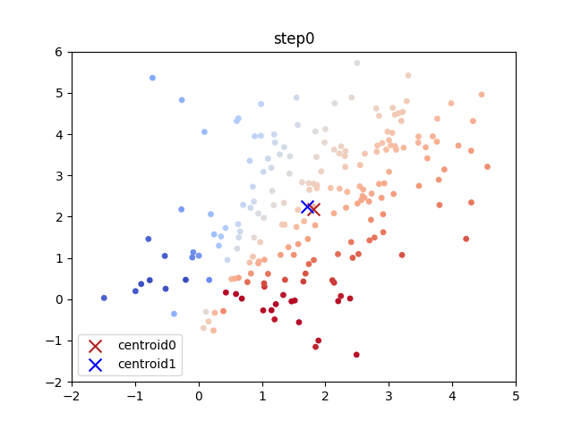
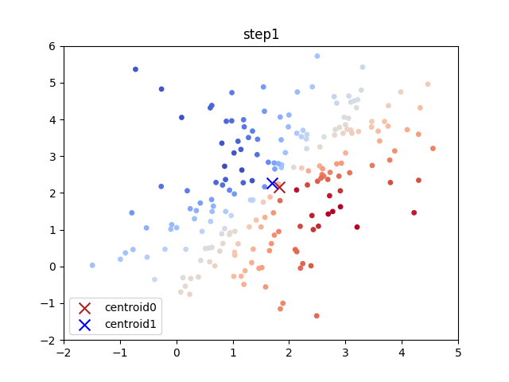
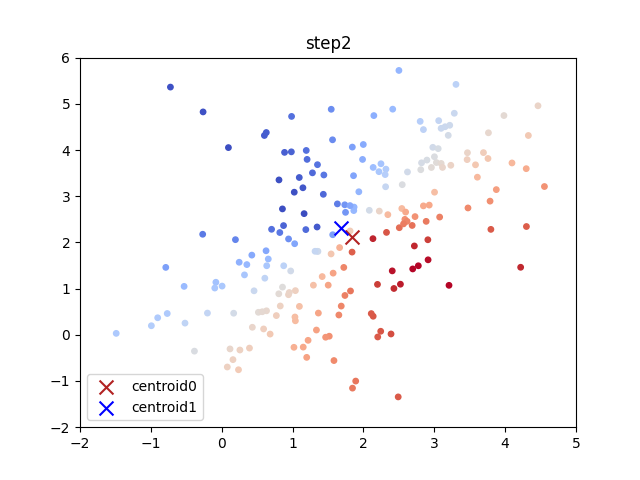
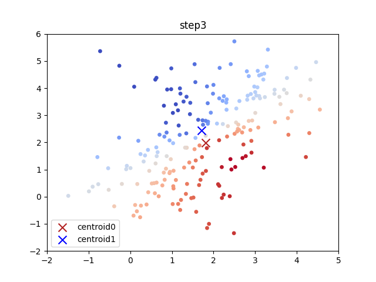
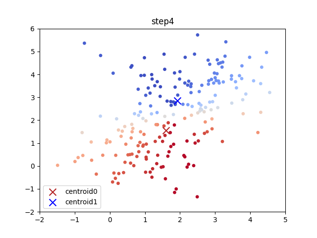

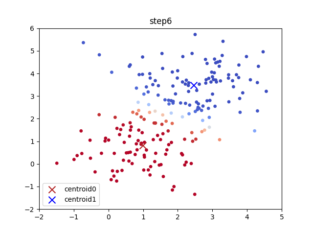

### When $\beta = 50$

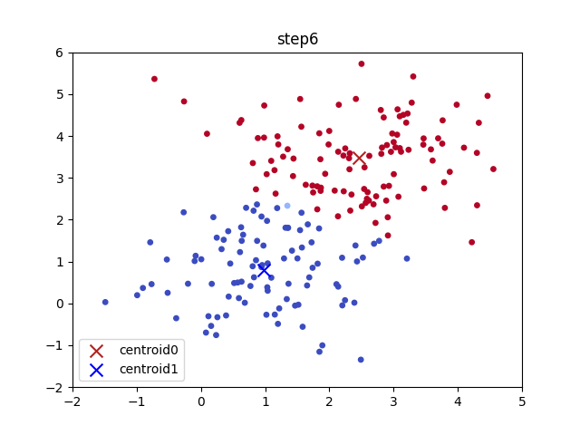

A larger $\beta$ reduces dynamics in responsibilities. With similar responsibilities for each point, the weighted sum that becomes the new centroid is more likely to deviate further each iteration.
